# Vector 3Dit for Inkscape: tutorial

A walk through the **3D Editor** of the Vector 3Dit Inkscape extension, one tab at a time.
Every picture is a real screenshot of the editor.

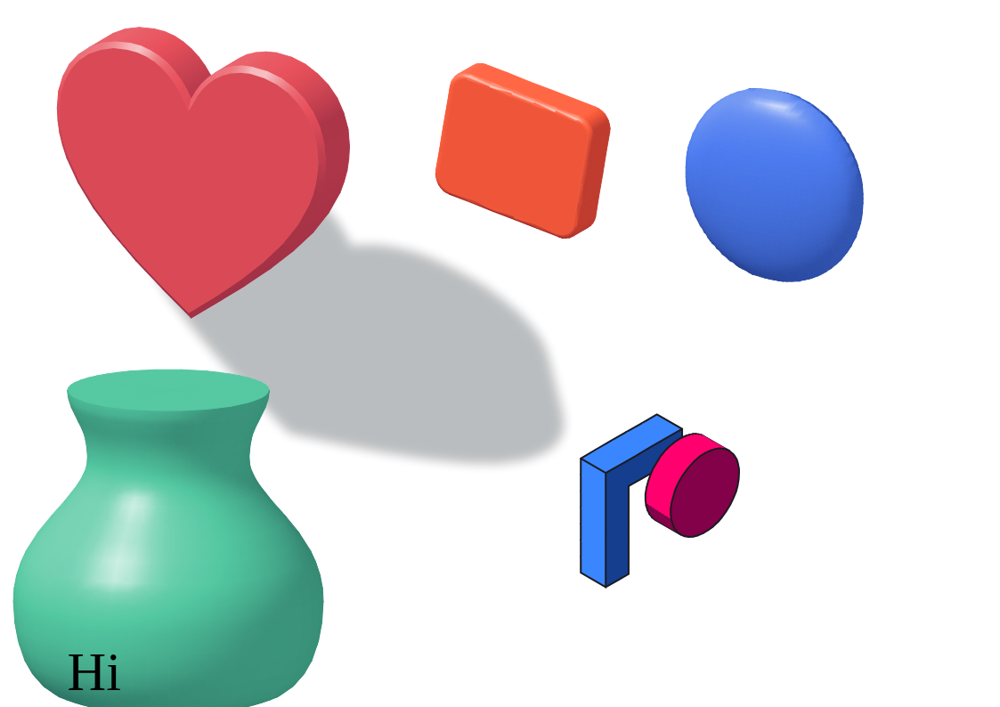

- **Not installed yet?** See the [install steps](../../inkscape-extension/#install).
- **Prefer a web page?** Download [`tutorial.html`](tutorial.html) and open it in your browser. It's the same tutorial, with numbered markers on the screenshots.

**Lessons:** [1 Open the editor](#1-open-the-3d-editor) · [2 The window](#2-find-your-way-around-the-window) ·
[3 Turn it](#3-turn-it-in-space-view-tab) · [4 Shape](#4-choose-how-it-becomes-3d-shape-tab) ·
[5 Surface](#5-pick-a-material-surface-tab) · [6 Colors](#6-color-each-side-colors-tab) · [7 Light](#7-aim-the-light-light-tab) ·
[8 Outline & shadow](#8-add-lines-and-a-shadow-outline-tab) · [9 Style](#9-fill-stroke-and-opacity-style-tab) ·
[10 Groups](#10-groups-and-several-objects) · [11 Edit later](#11-apply-edit-later-or-undo) · [12 Shortcuts](#12-shortcuts)

---

## 1. Open the 3D Editor

1. Draw a shape in Inkscape, for example a heart, star or circle, and give it a fill color.
2. Select it. You can select several shapes, or a whole group.
3. Choose **Extensions › Vector 3Dit › 3D Editor…**

> **Text?** Turn it into shapes first with **Path › Object to Path**. Text objects are skipped.
>
> **While the editor is open,** Inkscape waits for it. Click **Apply** or **Cancel** to get back to your drawing.

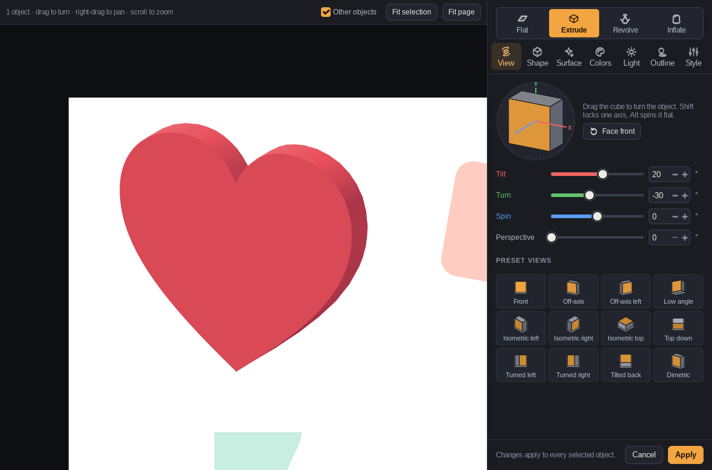

## 2. Find your way around the window

| Part | What it does |
| --- | --- |
| **Kind** (top of the panel) | Flat, Extrude, Revolve or Inflate: how the flat shape becomes 3D. |
| **Tabs** | View, Shape, Surface, Colors, Light, Outline and Style. Each holds one group of tools. |
| **Trackball** | The little cube shows which way the object faces. Drag it to turn. |
| **Preview** (left) | Your page, with the objects in 3D exactly where they'll land. The rest of the drawing is faded behind them. |
| **Preview tools** (top) | **Other objects** shows or hides the rest of the drawing, **Full color** shows it in its real colors, and **Fit selection** / **Fit page** zoom. |
| **Apply / Cancel** | Apply writes the result into your drawing. Cancel leaves it unchanged. |

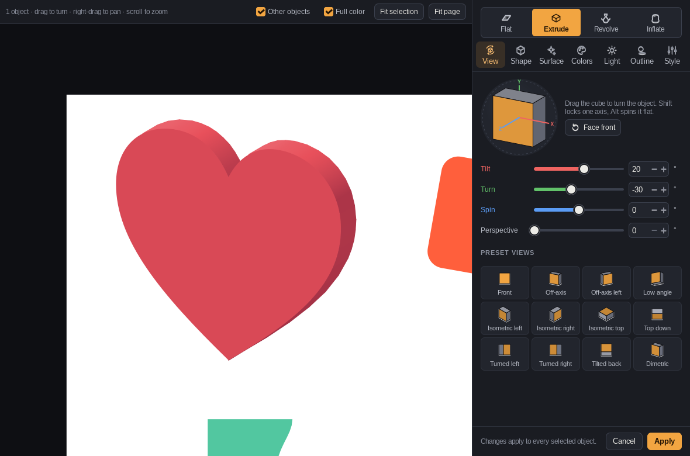

## 3. Turn it in space (View tab)

1. Drag the cube on the trackball. You can also drag the object in the preview itself.
2. Or click a **preset view**. Isometric right is a good start for icons and logos.
3. Fine-tune with the sliders: **Tilt** turns around the horizontal axis, **Turn** around the vertical axis, **Spin** within the page.

> Hold **Shift** while dragging to turn around one axis only, or **Alt** to spin flat. **Face front** resets the rotation.
> **Perspective** adds depth like a camera lens; 0 keeps parallel lines parallel.

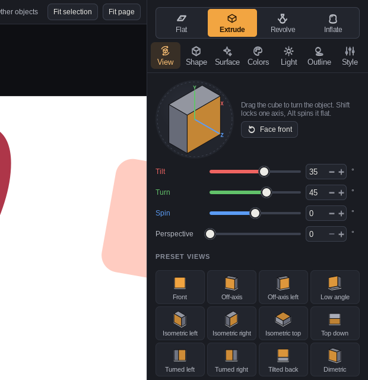

## 4. Choose how it becomes 3D (Shape tab)

Pick a kind at the top of the panel, then open the **Shape** tab. It shows only the settings for that kind.

### Extrude and bevel

1. With **Extrude** picked, set the **Depth**. Turn off **Solid** for a hollow tube.
2. Click the **Bevel** box to open the profiles.
3. Pick one, like **Round**. Then set the bevel's width, height and smoothness, front or both sides, inward or outward.

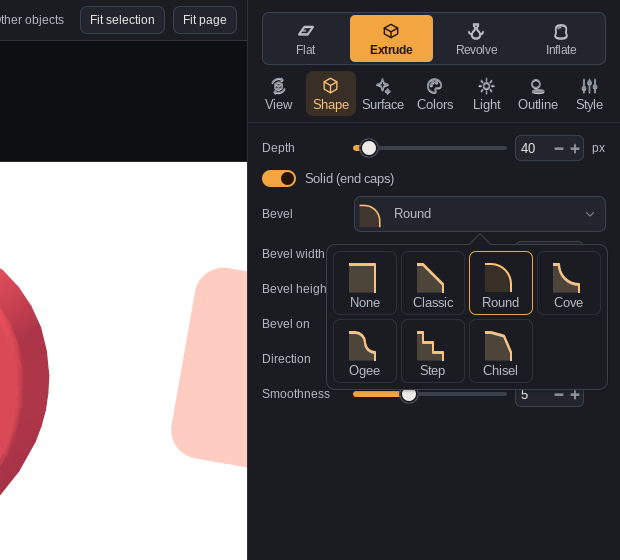

### Revolve

1. Draw **half** an outline, like half a vase, with its straight side on the left.
2. Pick **Revolve**. The shape spins around that edge like clay on a potter's wheel.
3. Set the **Axis** to the straight edge. An **Angle** below 360° cuts it open; **Offset** makes rings.

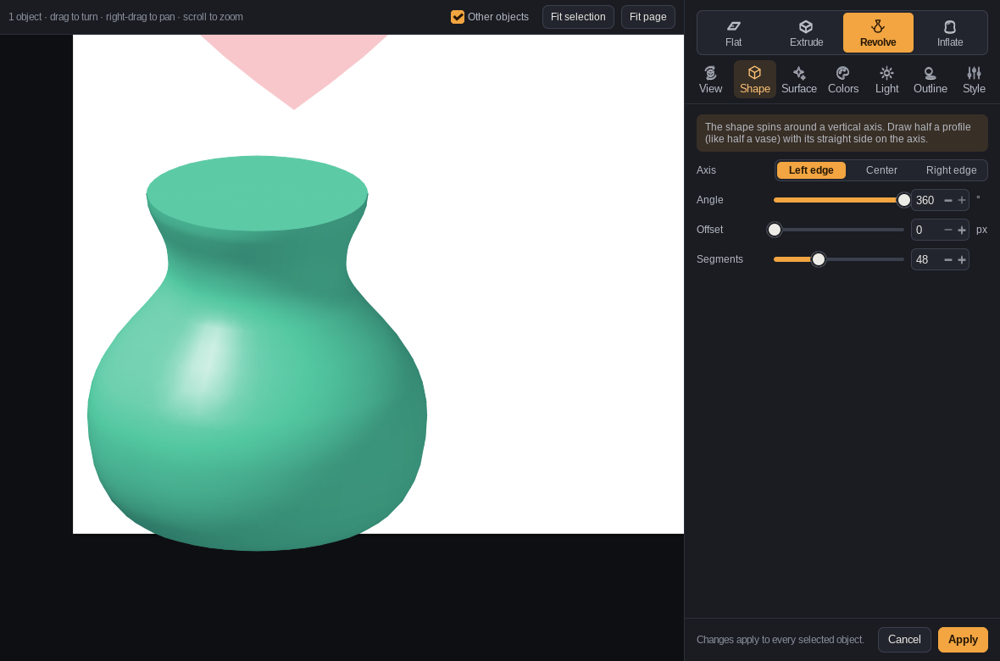

### Inflate

1. Pick **Inflate** to puff the shape up like a balloon.
2. **Puffiness** sets the height. **Profile** sets the curve: Round, Pillow, Dome, Soft or Sharp.
3. Raise **Detail** for smoother curves (larger files).

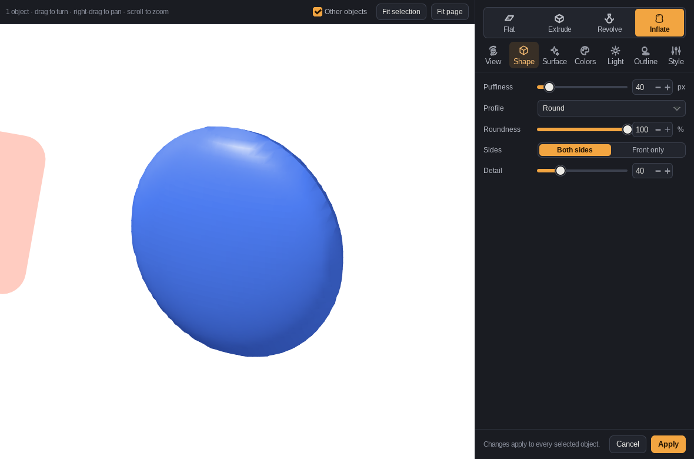

## 5. Pick a material (Surface tab)

1. Click a **material swatch**. Toon gives flat cel bands and an outline. Chrome, Gold and Copper give a metal look.
2. Change **Shading** or **Color bands** to fine-tune. 2 to 6 bands give a poster look.

> **Smooth gradients** draws curved surfaces with real vector gradients, so rounded shapes look smooth at any size.

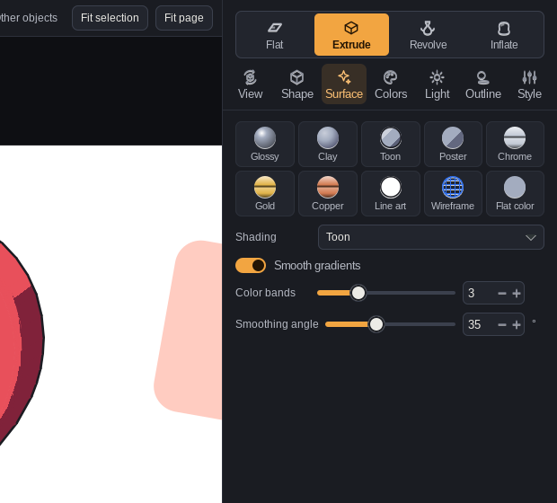

## 6. Color each side (Colors tab)

1. Click a color to open the color picker. **Front** is the shape's own color.
2. **Sides**, **Bevel** and **Back** follow the front color until you set them. **Auto** puts them back.
3. **Shadow tone** sets the color of the dark sides: tinted, black or your own color.

With several objects selected, a color you set applies to all of them.

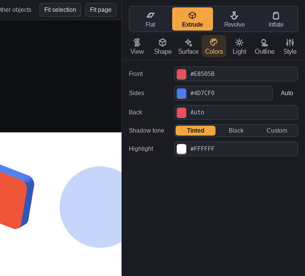

## 7. Aim the light (Light tab)

1. Drag the **sun** on the sphere to where the light should come from. Drag past the rim to light from behind.
2. Set **Intensity**, **Ambient** (light on every side), **Fill light**, **Highlight** and **Gloss**.
3. Leave **Shared scene light** on to give every 3D object in the drawing the same light, so the whole scene matches.

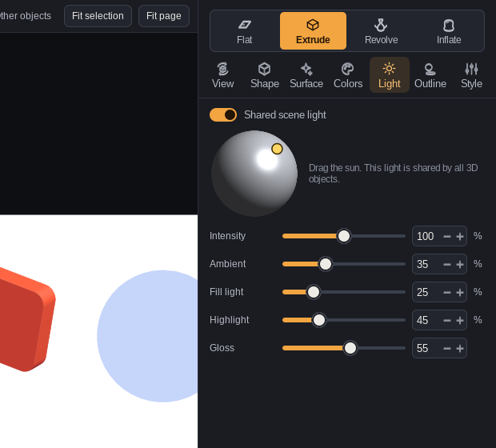

## 8. Add lines and a shadow (Outline tab)

1. **Edge lines:** Outline draws the silhouette and sharp edges. All draws every facet, for a wireframe look.
2. **Shadow:** Cast throws a shadow onto the page, away from the light. Floor adds a soft shadow underneath.
3. Set the shadow's opacity, softness, distance and color.

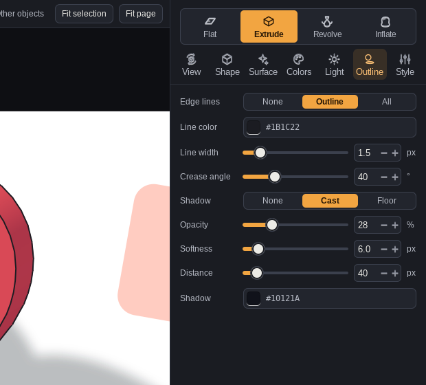

## 9. Fill, stroke and opacity (Style tab)

1. **Fill** is the shape's color, the same as Front on the Colors tab.
2. **Stroke** draws lines around the 3D object. Pick a color, or **None** to remove it. Set its width, and whether it draws the outline or every edge.
3. **Opacity** makes the whole object see-through.

> **The color picker** opens inside the editor: drag in the square for shade, drag the rainbow bar for hue, type a hex code,
> or click a palette color. Your recent colors show at the top.
>
> A shape that already has a stroke in Inkscape keeps it when made 3D. The fill and stroke you set here are saved on the shape,
> so **Remove 3D** gives it back with them.

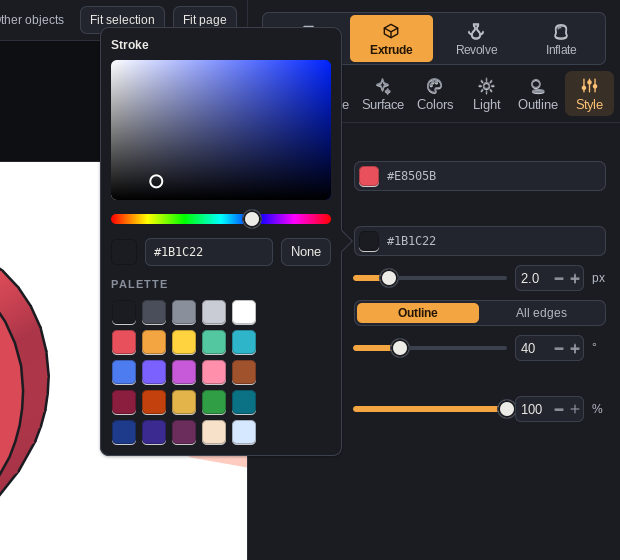

## 10. Groups and several objects

- **Select a group** (a logo, for example) and every shape in it becomes 3D. They all turn together around the group's center, so the logo stays in one piece.
- **Select several objects** to change them all at once. Only the settings you touch change. Everything else stays as each object has it.
- Each shape **remembers its group's center**, so you can later edit one piece alone without it jumping out of place.

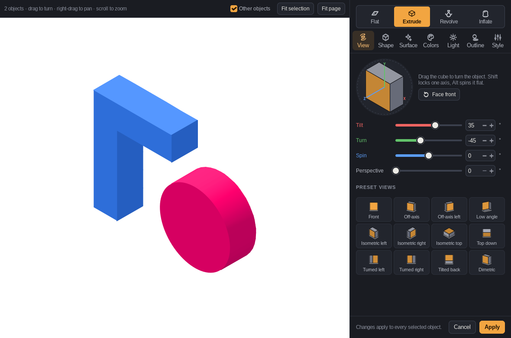

## 11. Apply, edit later, or undo

- **Apply** puts the result in your drawing as a group of plain vector shapes. You can move, scale and export it like anything else.
- **Edit it again:** select the 3D object and open the 3D Editor. It opens with that object's current settings.
- **Undo:** **Ctrl+Z** in Inkscape undoes the whole Apply in one step.
- **Back to flat:** **Extensions › Vector 3Dit › Remove 3D** puts the original shape back, with its id, fill and stroke.
- **Edit the outline:** Remove 3D, reshape the path with Inkscape's tools, then open the 3D Editor again.
- **Detach it for good:** ungroup the result and delete the hidden `v3d-source` path. After that it can't be re-edited.

## 12. Shortcuts

| In the 3D Editor | Does |
| --- | --- |
| Drag the cube | Turn the objects |
| **Shift** + drag | Turn around one axis only |
| **Alt** + drag | Spin flat, within the page |
| **← → ↑ ↓** (after clicking the cube) | Turn in 5° steps |
| Scroll on the preview | Zoom in and out |
| Right-drag the preview | Pan around the page |
| **Ctrl+Enter** | Apply |
| **Esc** | Cancel and close |
